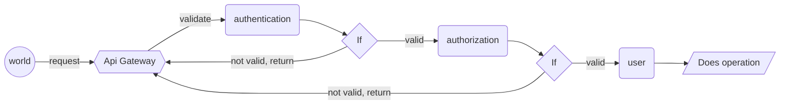
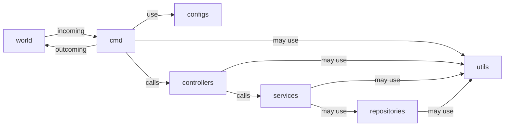
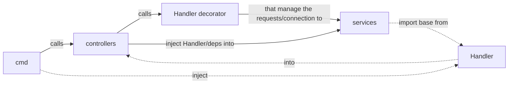
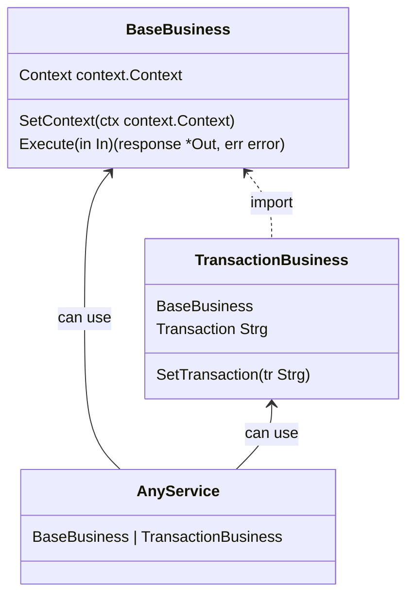

# go-grpc-microservice-stream

## Todo

ERROR: [transport] transport: http2Server.operateHeaders parsed a :connection header which makes a request malformed as per the HTTP/2 spec
There's a lack of documentation for this. https://kennethjenkins.net/posts/go-nginx-grpc/.
Therefore, I choosed envoy


### Needed

- [ ] Fix workflows
- [ ] Improve general doc
- [ ] Improve user doc
- [ ] Test workflow (using general approach)

### Improvements

- [ ] Add two factor for user, generating QR code
- [ ] Add tests
- [ ] Add [validations] to each use case
- [ ] Allow to run query without use transactions
- [ ] Add error status codes and return BaseResponseObject (treat on handler)
- [ ] Add a way to rollback microservices
- [ ] Start article and create a new tag to the final Part 1
- [ ] Add logging middleware with RequestId (sent by orchstrator)


## Directory plan

- Phase #1: Simplest microservice
  This microservice will not handle with tech errors, it'll be syncronous and
  will not have any compensation procedure to handle with business failures

- Phase #2: Use a Saga orchistration pattern
  By now, the microservices will not communicate between them, instead, it'll
  exist a single service that will be responsible to orchistrate the business
  flow. With this approach, the microservices will not impact in the others
  directly, and you'll have a centrilized point of error. You need to implement
  a compensation for business errors too.

- Phase #3: Transform the compensations into events approach
  With this improvement, we'll be able to retry on rollbacks that failed due to
  tech errors and we still keep the syncronous creation, therefore, we'll be
  long pooling (or using websocket) with client.


## How to execute?

First of all, create the images of each module by typing:

```bash
# generate the local image. To see other options, type `make help`
make docker
```

If the images generated, then you type

```bash
docker-compose up -d
```

After that you can test the applications with
[Bloom gRPC client](https://github.com/bloomrpc/bloomrpc/releases/tag/1.5.3)


```bash
docker-compose up -d
```

## How this microservices works?

### Ideal scenario

With this, you only have to map the external connections with internal services,
it also gives you possibility to change in only one place, i.e, it makes the
code more decoupled





## Dev

### How these repositories works internally?



- `cmd`: Initialize the applications modules
- `configs`: Holds the data that will be used to setup services, controllers and the application itself
- `controllers`: It holds the delivery layer (HTTP, graphQL, gRPC and go on)
- `repositories`: Keeps all places that store/retrieve data, which means cache; database and others approaches
- `services`: It holds the business logic, it also must implement ways of inject repositories into the use cases
- `utils`: Every method that it's not properly dependent of a business logic


#### The ***"handle middleware mechanism"***


The `Handler Decorator` is an outcoming layer for the controllers.
With this approach you can commit/rollback transactions and set status codes and
another response parameters that you may like.

In this application, the handler only does commit/rollback with transactions an
return the parsed non-transactions use cases, however, it's such a good approach
'cause, in HTTP Rest client, for example, when using **gin** framework, you can
return always a Response base object from your use cases and using them, set
status codes, body responses, default headers and go on, working like a pseudo
middleware.





The `services/base` is the base objects that makes the controller decorator work
and it must be inherited by every service.

The `controllers/base` is the proper Handler itself, it defines the objects that
can be injected and take care of the databases transactions


The class diagram of this approach can be seen below:



<!-- Links -->

[validations]: https://github.com/go-playground/validator


https://stackoverflow.com/questions/65897760/how-to-disable-route-timeout-in-envoy
https://github.com/improbable-eng/grpc-web
https://github.com/kubernetes/ingress-nginx/issues/8086
https://www.nginx.com/blog/deploying-nginx-plus-as-an-api-gateway-part-3-publishing-grpc-services/