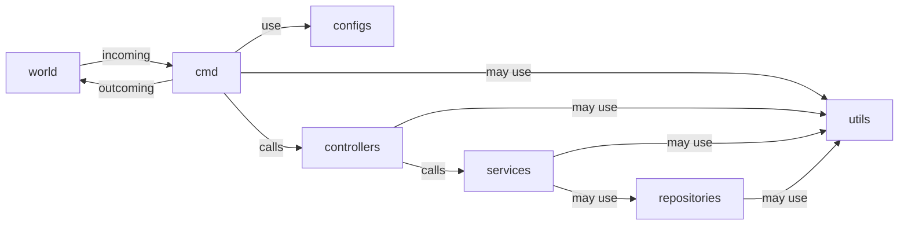
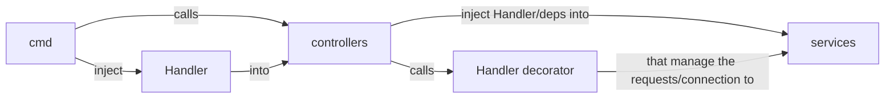

# microservice: authentication

Responsible to:

- Login (Generate JWT token)
- Refresh (Update token basing with an old one)
- Validate sessions
- Invalidate sessions

It uses JWT under the hood. It alsos uses Go subpackages.
Basing this approach on https://curity.io/resources/learn/jwt-best-practices/

## How this repository works:



- `cmd`: Initialize the applications modules
- `configs`: Holds the data that will be used to setup services, controllers and the application itself
- `controllers`: It holds the delivery layer (HTTP, graphQL, gRPC and go on)
- `repositories`: Keeps all places that store/retrieve data, which means cache; database and others approaches
- `services`: It holds the business logic, it also must implement ways of inject repositories into the use cases
- `utils`: Every method that it's not properly dependent of a business logic


The "***handle mechanism***":



The `Handler Decorator` is an outcoming layer for the controllers.
With this approach you can commit/rollback transactions and set status codes and
another response parameters that you may like.


## How to generate some key?

This project is currently using ECSDA P512 algorithm to auth the JWT token.
To generate a new key, type:

```bash
# Generates a new key, which should be in some var
ssh-keygen -t ecdsa -b 521
```

## TODO

- [  ] Allow repositories the possibility to use NonTransaction connection