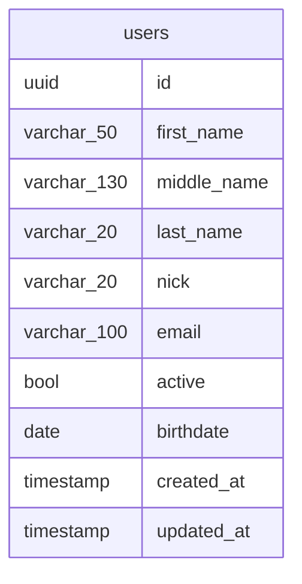

# microservice: authentication

Responsible to:

- Login (Generate JWT token)
- Refresh (Update token basing with an old one)
- Validate sessions
- Invalidate sessions

It uses JWT under the hood. It alsos uses Go subpackages.
Basing this approach on https://curity.io/resources/learn/jwt-best-practices/


## How it works?


## Database

Note that users don't belong to current database and it's response depends on
the user's crud to remove them.



## How to generate some key?

This project is currently using ECSDA P512 algorithm to auth the JWT token.
To generate a new key, type:

```bash
# Generates a new key, which should be in some var
ssh-keygen -t ecdsa -b 521
```


Install

```bash
curl -sSfL https://raw.githubusercontent.com/golangci/golangci-lint/master/install.sh | sh -s -- -b $(go env GOPATH)/bin v1.45.2
```

## TODO

- [ ] Allow repositories the possibility to use NonTransaction connection


## See

- https://github.com/golang-migrate/migrate/tree/master/cmd/migrate


